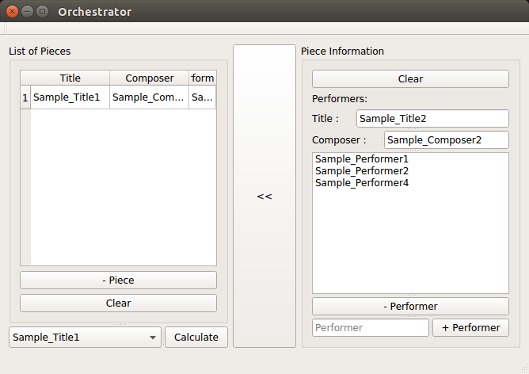

# COMPOSER!
---
Intuitive Approach to Composition by *Drawing* the music.

UI :

Features : 
- [x] Interactive UI
- [x] Inverse Fourier Transform on Drawn Signal
- [ ] Playing transformed signal real-time
- [x] Brush Opacity: Frequency Content(Strength)
- [x] Brush Size: Frequency Distribution
- [x] Resizing time-domain when drawing
- [x] Resizing Frequency-domain when drawing
- [ ] Linear Interpolation to achieve 44100 samples/sec
- [ ] Snapping to Fractional Beat/Tempo
- [x] Snapping to Pitch
- [x] Pitch Label on side -> implemented with red lines marking Cs
- [x] Threading For iFFT calculation
- [x] Stop Button
- [x] Save Functionality

BugFix :
- [ ] UI not initialized properly at startup
